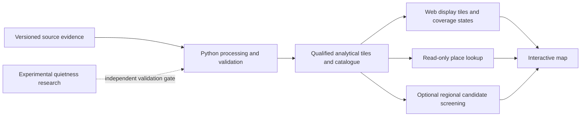

# Quiet UK: product review and route back to the original goal

Review date: 18 September 2026. Reviewed the current local working tree, including uncommitted work. This is a product, architecture, data and targeted code review, with fresh verification described below. It is not an independent acoustic certification or a line-by-line security audit. Application code and scientific outputs were not changed.

**The project has built a substantial England noise-data foundation, but the experience you originally wanted is still largely ahead of it.** The most useful next step is a beautiful, understandable map backed by that foundation. More acoustic modelling should have its own evidence-driven programme; it should not keep postponing the map.

The original goal is coherent: “Help me explore the UK and understand where human-made noise is lower or higher, through a beautiful map that makes both the evidence and its limitations easy to understand.” Looking for a home, a walk, a weekend away or simply exploring should all fit within that experience. None needs to become the defining product category.

There are two different ambitions here. A useful map of mapped transport-noise exposure is achievable using existing foundations. Reliably identifying the genuinely quietest places, especially below official reporting cutoffs, requires additional evidence. A polished interface cannot resolve that scientific limitation, but it can explain it without overwhelming people.

**Where the project stands today**

| Capability | Current state | What this means for your goal |
|---|---|---|
| England data processing | Substantial implementation; 1,498 completed 100 m raster tiles present | A valuable reusable foundation exists |
| England land coverage | Stored road/rail upper values in 13,086,924 cells | National browsing need not wait for another research model |
| Data integrity | Build identities, locking, semantic checks, explicit source-grid policies, catalogue hashes and qualification | Preserve these protections; they address real failure modes |
| Point inspection | Read-only catalogue supports BNG and longitude/latitude lookup | Useful backend for clicking a place on a map |
| Candidate extraction | Bounded regional extraction; connectivity, area filtering and actual cell polygons | Useful optional “find areas here” feature |
| Candidate interface | Working local SVG inspector of a previously generated result; 128 areas in the default pilot | Technical inspection, not a geographic exploration product |
| Screening API | Local single-job service with validation and output endpoints | Reusable orchestration, but not connected to the viewer |
| Quiet-to-loud browsing | No continuous nationwide interactive layer | The core experience is missing |
| Geographic orientation | No basemap, place names, place/postcode search or normal geographic pan/zoom in the viewer | Users cannot readily relate results to places they know |
| Whole UK | England only | Scotland, Wales and Northern Ireland remain separate ingestion/harmonisation work |
| Detailed quietness ranking | Official cutoff ties; experimental road model not independently validated | “The quietest place” claims are not supported |
| Source toggles and night/day views | Frozen national output combines road/rail; national metric is Lden | Separate road, rail and night layers require suitable additional source products |
| Homes, trails and access | Access is explicitly unassessed; research walking examples are diagnostics | These are future overlays, not delivered user workflows |
| Public delivery | Local tools; no deployed product workflow found | Hosting, distribution and release operations remain |

The national output has four bands: `combined_reported_lower_db`, `road_rail_upper_db`, `airport_reported_lower_db`, and `airport_reported_fraction`. It has no national all-source upper bound, separate road/rail levels, dominant-source band, or national quietness rank. In particular, the airport-inclusive lower bound and road/rail-only upper bound are **not the endpoints of one noise interval**.

**What I verified during this review**

- Ran `.\.venv\Scripts\python.exe -m pytest -q`: **345 passed, 2 skipped in 45.09 seconds**. This tests implementation behaviour, not whether a real place sounds quiet.
- Counted 1,498 current tile files and 1,498 `complete` manifest entries. Read band 2 and band descriptions from every tile. All had the four-band schema above. The tiles total 66,162,087 bytes, approximately 66 MB compressed.
- Counted 13,086,924 finite, non-nodata stored road/rail upper values. **5,055,564 cells, or 38.6307%, match the approximately 43.0103 dB censoring floor** within 0.00001 dB. These are stored-value counts before qualification filtering.
- Exercised the current v3 catalogue at five existing diagnostic coordinates. Confirmed qualified data, aviation withholding, aviation coverage limitation, outside-England land, and no-dataset-coverage states. The catalogue withheld affected values rather than presenting them as trustworthy measurements.
- Started the actual viewer on loopback, inspected its live layout and selected another candidate; map/list selection updated the details. It loaded the 128-component pilot. Also inspected the existing narrow screenshot and browser-verification record; the narrow screenshot is prior evidence, not a fresh phone-device test.
- Reproduced the previously reported research support-radius issue: one 10 km road versus ten equivalent 1 km segments changed the finite-line feature by **0.60946 dB-equivalent** near its selection boundary. This is a research-feature difference, not a measured prediction error and not corruption of the frozen England raster.
- Reviewed source code, the latest catalogue/coverage/provenance reports, research results, dependency declarations, Git state and official source documentation.

The latest saved coverage report says road/rail data is structurally qualified for **99.9863%** of the England mask; 1,798 cells are withheld. Airport-dependent bands have much larger limitations: the combined reported lower band is qualified for 74.2230%, qualified with coverage limitation for 19.8684%, and withheld for 5.9086%. Those qualification figures come from the existing report, not a fresh full national semantic/provenance audit. “Qualified” here means accepted source-grid evidence, not independently verified acoustic accuracy.

I did not redownload provider data, regenerate the national dataset, repeat the complete national QA, rerun model fitting, test a public deployment, inspect the remote GitHub working state, or conduct field measurements.

**What is good and should be retained**

The acoustic arithmetic respects logarithmic sound-energy combination and handles censored cells carefully. The system does not equate an absent airport value with silence. Source qualification, deterministic extraction, geometry checks and controlled publication are useful. The tests cover substantive behaviours, including corrupt inputs, mismatched identities, concurrency, geometry and HTTP failures.

The later integrity work has addressed several findings in the 11 September review: strict metric selection, build compatibility, semantic tile validation, source-grid restrictions and cooperative locking now exist. Restarting that entire integrity phase would waste effort. Historical rasters still predate those protections; new code does not retroactively create their missing acquisition records.

The current viewer is visually restrained and internally consistent, and its selection works. The backend is not a reason to start over. Its main shortcoming is that the interface exposes the vocabulary and shape of internal data processing rather than the questions people bring to a map.

**Where the work has drifted**

The sequencing has favoured deeper modelling, provenance reconciliation, output contracts and edge-case hardening before delivering the basic exploration journey. Much of that work is defensible individually. Collectively, it has allowed engineering completion to stand in for product progress.

The first screen demonstrates this: run IDs, retained-cell counts, component counts and a technical scope explanation occupy the prime space. Areas have hash-based identifiers rather than recognisable names. At the saved 620 × 900 size, the map is below the initial viewport. Neither a quiet-versus-loud colour scale nor familiar geography is visible.

Candidate extraction has also become the organising idea. It answers “which contiguous cells pass this road/rail threshold in this rectangle?” Your original question is broader: “what is this place like, and how does it compare with somewhere else?” A continuous map and click-to-understand interaction should be primary. Candidate extraction should be an optional tool within it.

Finally, the project has narrowed to finding low road/rail candidates and largely omitted the other half of the original idea: making loud areas legible. A good explorer should explain the full gradient, not merely retain acceptable polygons and leave the rest blank.

**Priority findings and improvements**

| Priority | Finding and evidence | Consequence | Recommended response |
|---|---|---|---|
| First | The main experience is absent: `candidate_viewer/index.html`, `app.js:493`, and the local viewer documentation show a fixed snapshot without basemap/search or screening submission | Further backend polish alone will not deliver the intended product | Build the map, search, legend and place card next; keep the inspector as a developer tool |
| First | 38.6307% of stored England cells tie at the road/rail censoring floor | Fine “quietest” ranks and precise-looking low dB numbers would manufacture distinctions | Show a below-reporting-detail category and preserve ties; explain the numeric bound on demand |
| First | Candidate eligibility at `src/quiet_uk/candidates.py:578` uses only the road/rail upper bound | An eligible area can still have aircraft noise or insufficient aviation evidence | Label screening scope explicitly and show aviation evidence/unknown state prominently; do not label these as universally quiet areas |
| First | Historical acquisition linkage remains unresolved in `artifacts/source_provenance_audit_v1/source_provenance.md` | The exact products, settings and periods behind the historical rasters are not fully demonstrated | Timebox evidence recovery, then create a newly traceable release if necessary; never fill historical gaps using today's configuration |
| First | README proposed fields and “validated workflow” differ from the actual four-band product | It is easy to mistake ambitions for completed capabilities | Replace the entry-point status with a short current-state table, real launch commands and one active roadmap |
| Next | `mosaic_tiles` at `src/quiet_uk/tiling.py:523` reads all inputs into memory, rejects every unoccupied rectangle cell, and writes ordinary GTiff | It is not a ready national COG/web publication path for a sparse land schedule | Add a separate windowed/virtual publishing path with expected-land checks and deliberate overview semantics |
| Next | The viewer's airport table at `candidate_viewer/app.js:401` shows fraction availability under generic “Finite / censored”; it omits the separate lower-bound availability and interpretation | The first candidate displays 930 finite values even though all 930 airport lower bounds are unreported; these are finite fraction values, not 930 noise observations | Rename the fields, show the relevant evidence state and explain “no reported airport pixels”; keep technical tables in expanded detail |
| Next | Production processing discards raw 10 m inputs and publishes no separate road/rail bands (`tiling.py:443`, `:476`, `:507`) | Per-source toggles, edge statistics and alternative temporal metrics cannot simply be added to this dataset in the UI | Design the next release schema around demonstrated product needs; retain traceable raw snapshots or immutable retrieval references as appropriate |
| Next | Local service is one active job, no queue, in-memory status and persistent output directories | Directly exposing it publicly would not provide a dependable multiuser service | Use static map assets for browsing; defer public computation, or add persistence, limits, cleanup and recovery when genuinely needed |
| Next | Current Git state contains 15 modified tracked files plus substantial untracked backend, tests, viewer and artifacts | Much of the current state is not represented by the latest commit; reproducing a checkout is difficult | Make a deliberate reviewed checkpoint and release/data inventory; separate source, small fixtures and generated assets before committing |
| Next | Package advertises Python >=3.11; the inspected locked NumPy, Rasterio and OWSLib distributions require >=3.12 | Documentation overstates support for the tested stack | Align supported Python versions, installation guidance and CI; retain the proven Windows 3.14 path |
| Later research gate | Phase 2C support-radius segmentation issue persists at `phase2c_road.py:512` and `:548`; saved quiet-boundary errors remain large | Research outputs are not ready to resolve fine differences between quiet places | Correct support geometry and independently validate before promoting results; this does not block the exploratory map |

There is no `.github` CI configuration in this working tree. The existing browser harness exercises wide and 620-pixel layouts, but this is not proof of a good small-phone or screen-reader experience. A modest CI pipeline and real interaction checks are appropriate; a large infrastructure programme is not.

The strongest evidence limitation is at the quiet end. Phase 2C reports 91.331% of road-link records using a global traffic fallback in its ten source windows, and approximately 6.7 dB mean absolute error for reported Lden values between 40 and 42 dB. These are saved experiment results, not national measured accuracy. Below-cutoff model predictions should remain experimental until independent evidence supports them.

**What the finished experience should feel like**

Open directly onto a beautifully styled, labelled map. Search for a town, postcode or area, or browse freely. See lower and higher mapped noise with a clear legend. Select a place and receive a short explanation of the mapped exposure, evidence coverage and what is not known. Compare a few places and save or share the current view. Home, walking and other contexts can later reveal relevant overlays without replacing this common journey.

Use a restrained basemap, legible typography, a carefully designed sequential noise palette and sufficient contrast. Keep geographic names readable through the noise layer. Give unknown or withheld coverage a distinct neutral pattern; it must never share the “quiet” colour. Do not interpolate through unknown areas or visually imply parcel-level precision from 100 m cells. Make low-zoom summaries explicit and test that narrow noisy corridors do not disappear misleadingly.

The initial place card should answer four questions: what does the mapping indicate here; which noise sources does that cover; how much is uncertain; and what can I do next? Detailed source IDs, grid states and processing history belong behind an evidence disclosure. Material uncertainty must remain visible in plain language, for example “Aircraft noise is not fully assessed here.”

“Below the map's reporting detail” is more defensible than “43.01 dB ambient noise.” Lden is a long-term indicator with evening/night weighting, not a sound-meter reading for a visit. Defra states that these strategic maps are modelled and may not represent the situation at a particular place on a particular day. [Official explanation](https://www.gov.uk/government/publications/strategic-noise-mapping-2022/explaining-the-2022-noise-maps).

For mobile, the map should be visible immediately, with search above it and a collapsible place card below. Design at actual narrow phone widths, not just 620 pixels. Include keyboard access, understandable focus, labels beyond colour, a text result alternative, loading/error/empty states and reduced-motion support.

**A small architecture is sufficient for the next product**

Keep Python for scientific processing, validation, catalogue access and optional bounded screening. Add a dedicated web client and a versioned publishing step. The core paths should be:

MapLibre GL JS is a reasonable map client to evaluate; its official documentation describes browser rendering of interactive maps. Precomputed raster display tiles are a sensible starting point for this continuous 100 m dataset. PMTiles is an option for distributing tiled assets, not a requirement and not the analytical dataset itself. Choose the simplest export/storage path after a regional performance check. [MapLibre documentation](https://maplibre.org/maplibre-gl-js/docs/), [PMTiles concepts](https://docs.protomaps.com/pmtiles/).

Keep analytical rasters and display assets separate. Build display levels using documented acoustic and coverage aggregation rules; ordinary arithmetic averaging of dB must not silently become an analytical summary. Click values should come from qualified analytical data, not sampled colours. Use explicit source release IDs in both paths so a map image and place card cannot describe different generations.

Basemap and geocoding choice should include attribution, permitted use, usage limits and operating cost. Do not build ordinary map panning around extraction jobs or a national GeoJSON download. There is no present need for microservices, a distributed scheduler, accounts or an infrastructure rewrite.

**Phased delivery plan**

These are planning ranges for one experienced developer with timely product/design feedback. They are not fixed quotes. Data-service availability, procurement, provenance recovery and independent fieldwork can extend them. Each phase should finish with a visible demonstration and an explicit evidence gate.

| Phase | Indicative effort | Deliverable | Exit condition |
|---|---|---|---|
| 0. Recover a clear project baseline | 1–2 days | One-page product brief, current-state README, active backlog, documented local launch, reviewed Git checkpoint and asset inventory | You can explain what exists, launch it, and distinguish production data, historical baseline and research; every new task has a user-facing reason |
| 1. Build the experience prototype | 3–5 days | A polished real regional map with basemap, search, pan/zoom, noise legend, coverage states and click card; wide and phone layouts | You can search for a familiar place, understand lower/higher mapped exposure, and explain an unknown area without help. Use actual regional data and clearly identify its historical status |
| 2. Publish a dependable England map | 1–2 weeks plus any reacquisition | Qualified national display tiles, versioned metadata, point lookup, deployment preview and traceable release decision | England browsing works at appropriate zoom levels; display/card data agree; withheld and outside-domain states remain visible; release provenance supports the claims actually shown |
| 3. Make exploration useful and test it | 1–2 weeks | Compare 2–3 places, local bookmarks, shareable views, optional “find lower-noise areas here,” understandable airport limitations, accessible responsive states | At least 4 of 5 fresh testers can find a place, distinguish mapped noise from unknown, compare alternatives and share a view without coaching; include tasks beyond homes/walks |
| 4. Complete UK geographic coverage | Roughly 2–6+ weeks, re-estimate after source audit | Country-specific adapters and metadata for Wales, Scotland and Northern Ireland, with consistent interaction and honest gaps | All four nations are represented; thresholds, metrics, dates, domains and coordinate systems are explicit; border views do not manufacture continuity or comparable ranks |
| 5. Earn better quiet-place distinctions | Separate gated research programme | Independently evaluated improvements below reporting cutoffs, then selected temporal/source/context layers | Predetermined validation criteria support any stronger claim. Failure leaves a useful explorer with narrower claims; it does not trigger automatic national model rollout |

The first satisfying visual milestone should be Phase 1, not the end of Phase 5. A useful England beta is plausibly several working weeks away under favourable conditions. There is no responsible fixed completion date for reliable, independently validated rankings of the UK's quietest places from this evidence alone.

During Phase 0, timebox the search for original acquisition records. If those records cannot establish the necessary historical claims, keep the historical baseline clearly identified and plan a new source-linked release. Do not spend indefinite cycles producing further reports about the same absent evidence. A fresh release should record provider product, metric, cutoff/domain semantics, reference period, request/response identity, software/configuration identity and output checksums. Preserve the old baseline rather than relabelling it.

Phase 1 does not need a whole-country rebuild, a complete source decomposition, a new noise score or a route planner. Start with the road/rail bound that actually exists and honest aviation/coverage information. Avoid decorative controls that promise data not yet available.

Phase 2 should verify urban, rural, coastal, tile-boundary, airport-affected and withheld examples; verify the lowest reporting-detail category; and check both source qualification and visible appearance. Suggested performance targets to measure, not present as existing results: useful initial map within 3 seconds on a documented midrange device/network, cached place details within 500 ms, and responsive pan/zoom. Retain the backend suite and add small end-to-end checks for search, click, coverage states and shared views. Public delivery also needs attribution, usage/cost limits, basic monitoring and rollback.

Phase 3 should introduce candidate screening only where it makes the journey easier. Convert visible geographic selections into clearly displayed grid-aligned requests; retain the engine's limits. Its 160,000-cell cap is 1,600 km², or 40 × 40 km for a square request. Explain oversized selections. Areas meeting a road/rail filter are not guaranteed publicly accessible and are ordered by area, not by proven quietness. Shared views should retain position, zoom, layer and dataset version.

Phase 4 should begin with a short source inventory during Phase 1 or 2 so the UK ambition stays visible. Wales already publishes all-road/all-rail mapping, Scotland describes 2021 all-road/all-rail maps, and Northern Ireland has a Round 4 viewer. These are promising starting points, not proof that their downloadable data, thresholds and geographic scope can be merged unchanged. British National Grid must not simply be assumed for Northern Ireland. [DataMapWales](https://datamap.gov.wales/layergroups/geonode%3AEnvironmental_Noise_Mapping_2022), [Scotland's Noise](https://noise.environment.gov.scot/map.html), [DAERA noise maps](https://www.daera-ni.gov.uk/services/noise-maps).

Phase 5 should start measurement feasibility planning early, with its own effort limit. Distinguish a “less human-made noise” ambition from total loudness: a windy coast or waterfall can be loud and still feel tranquil. Do not collapse these into a single unsupported score. Compare any new model against simple baselines, use geographically independent evaluation, correct the known radius issue, and report failures. Short field visits can test visit-scale experience; they do not directly validate annual Lden. Exact acoustic, ranking and uncertainty acceptance thresholds need a defined measurement protocol and suitable expert input before collecting the main validation set.

Choose later layers from observed needs: night exposure, separate road/rail information, aircraft event evidence, quiet cores away from noisy edges, terrain/land cover, or public access. Homes may benefit from neighbourhood comparison and night information; walks may benefit from route exposure and verified access. Build these as optional contexts on the shared explorer. A property marketplace, a full routing engine or a national live-flight model should require its own demonstrated benefit and scope decision.

**The next ten working days should have a deliberately small brief**

1. Establish the project brief and current-state checkpoint; identify the exact baseline used by the prototype.
2. Design the map, legend and place card together on desktop and a narrow phone layout.
3. Connect a real regional noise display and point lookup; include a loud corridor, a low-detail quiet region and an unknown/withheld example.
4. Add search, sensible pan/zoom, dataset/coverage explanation and a shareable view.
5. Demonstrate it with unfamiliar users; fix confusion before expanding features.
6. Begin national display publishing and the timeboxed release-provenance decision only once the regional interaction works.

The acceptance demonstration is simple: open the map, find a familiar town, recognise a noisy corridor and a lower-mapped-noise area, select both, understand what is uncertain, and share the comparison. It should be pleasant enough that you want to explore somewhere else.

Pause further national road reconstruction, elaborate rankings, mass acquisition of context layers, large-scale infrastructure and another standalone audit cycle unless one resolves a specific release blocker. Preserve the existing experiments and tests. Do not delete research or rewrite the acoustic engine to make the project feel simpler.

**How to prevent the same drift**

Maintain one active roadmap. Mark older plans as historical references and record what superseded them. Every proposed task should state the user behaviour it enables, the evidence problem it resolves, its exit condition and what will be visible at completion. For the next iteration, spend the majority of effort on the map and its user journey; reserve backend work for specific defects and delivery needs. Demonstrate progress each week rather than measuring it by script count, test count or the number of completed technical phases.

The existing work is useful. The correction is to make geographic exploration the centre of the project and let engineering, evidence and later use cases serve that experience.

**Evidence index**

- Current UI: `candidate_viewer/index.html`, `candidate_viewer/app.js`, `candidate_viewer/styles.css`.
- Actual product/band semantics: `src/quiet_uk/catalogue.py:61`, `src/quiet_uk/tiling.py:420`, `config.json`.
- National historical QA: `notes/ENGLAND_NATIONAL_VALIDATION.md`, `data/processed/england/qa/`.
- Latest coverage/qualification: `artifacts/england_dataset_report_v3/dataset_report.md`.
- Historical provenance: `artifacts/source_provenance_audit_v1/source_provenance.md`.
- New integrity protections: `notes/PHASE1_INTEGRITY_PROTECTIONS.md`.
- Current candidate contract: `notes/CANDIDATE_SCREENING.md`, `src/quiet_uk/candidates.py`.
- Viewer and service contracts: `notes/CANDIDATE_VIEWER.md`, `notes/SCREENING_JOBS.md`.
- Saved browser evidence: `artifacts/candidate_viewer_verification_v1/`.
- Research results and limitations: `notes/PHASE2C_ROAD_SOURCE_INTEGRITY.md`, `results/phase2c/`.
- Earlier review, partly implemented since: `notes/PROJECT_REVIEW_AND_IMPROVEMENT_PLAN.md` dated 11 September 2026.
- Fresh review checks and concise reproduction information: `notes/PRODUCT_REVIEW_EVIDENCE_2026-09-18.json`.
